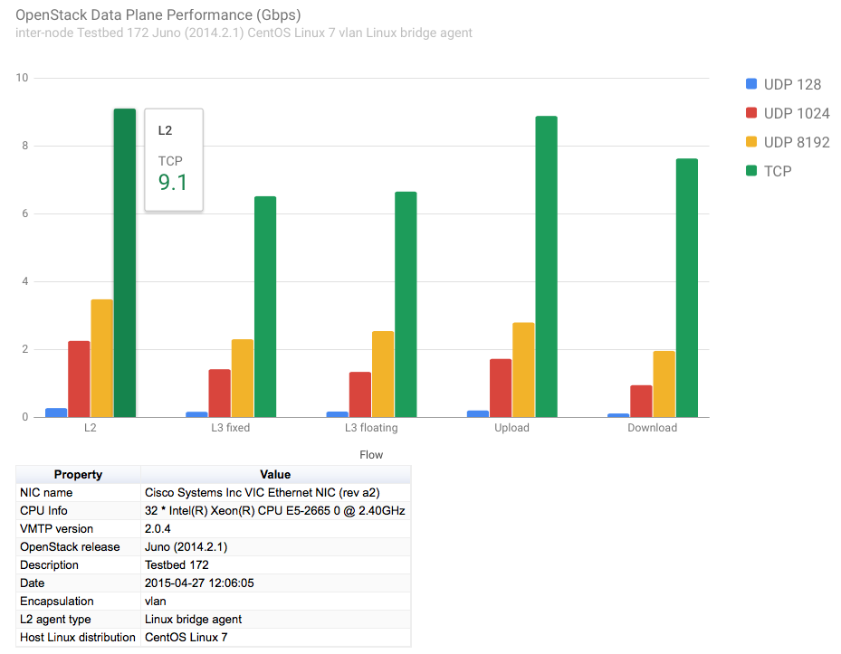

========
Overview
========

VMTP is a data path performance measurement tool for OpenStack clouds.

Features
--------

Have you ever had the need for a quick, simple and automatable way to get VM-level or host-level single-flow throughput and latency numbers from any OpenStack cloud, and take into account various Neutron topologies? Or check whether some OpenStack configuration option, Neutron plug-in performs to expectation or if there is any data path impact for upgrading to a different OpenStack release?

VMTP is a small python application that will automatically perform ping connectivity, round trip time measurement (latency) and TCP/UDP throughput measurement for the following East/West flows on any OpenStack deployment:

* VM to VM same network (private fixed IP, flow #1)
* VM to VM different network using fixed IP (same as intra-tenant L3 fixed IP, flow #2)
* VM to VM different network using floating IP and NAT (same as floating IP inter-tenant L3, flow #3)

Optionally, when an external Linux host is available for testing North/South flows:

* External host/VM download and upload throughput/latency (L3/floating IP, flow #4 and #5)

.. image:: images/flows.png

Optionally, when SSH login to any Linux host (native or virtual) is available:

* Host to host process-level throughput/latency (intra-node and inter-node)

Optionally, VMTP can extract automatically CPU usage from all native hosts in the cloud during the throughput tests, provided the Ganglia monitoring service (gmond) is installed and enabled on those hosts.

For VM-related flows, VMTP will automatically create the necessary OpenStack resources (router, networks, subnets, key pairs, security groups, test VMs) using the public OpenStack API, install the test tools then orchestrate them to gather the throughput measurements then cleanup all related resources before exiting.

See the usage page for the description of all the command line arguments supported by VMTP.

Online Documentation
--------------------
The complete documentation for VMTP including installation and usage guide is available at http://vmtp.readthedocs.io/en/latest

Pre-requisite
-------------

VMTP runs on any Python 2.X envirnment (validated on Linux and MacOSX).

For VM related performance measurements
^^^^^^^^^^^^^^^^^^^^^^^^^^^^^^^^^^^^^^^

* Access to the cloud Horizon Dashboard (to retrieve the openrc file)
* 1 working external network pre-configured on the cloud (VMTP will pick the first one found)
* At least 2 floating IP if an external router is configured or 3 floating IP if there is no external router configured
* 1 Linux image available in OpenStack (any distribution)
* A configuration file that is properly set for the cloud to test (see "Configuration File" section below)

For native/external host throughputs
^^^^^^^^^^^^^^^^^^^^^^^^^^^^^^^^^^^^

* A public key must be installed on the target hosts (see ssh password-less access below)

For pre-existing native host throughputs
^^^^^^^^^^^^^^^^^^^^^^^^^^^^^^^^^^^^^^^^

* Firewalls must be configured to allow TCP/UDP ports 5001 and TCP port 5002

Sample Results Output
---------------------

VMTP will display the results to stdout with the following data:

.. code::

    Summary of results
    ==================
    Total Scenarios:   22
    Passed Scenarios:  17 [100.00%]
    Failed Scenarios:  0 [0.00%]
    Skipped Scenarios: 5
    +----------+--------------------------------------------------+-------------------+----------------------------------------------------------------------------------+
    | Scenario | Scenario Name                                    | Functional Status | Data                                                                             |
    +----------+--------------------------------------------------+-------------------+----------------------------------------------------------------------------------+
    | 1.1      | Same Network, Fixed IP, Intra-node, TCP          | PASSED            | {'tp_kbps': '19262752', 'rtt_ms': '0.38'}                                        |
    | 1.2      | Same Network, Fixed IP, Intra-node, UDP          | PASSED            | {128: {'tp_kbps': 243360, 'loss_rate': 0.0}, 1024: {'tp_kbps': 1790414,          |
    |          |                                                  |                   | 'loss_rate': 0.0}, 8192: {'tp_kbps': 9599648, 'loss_rate': 0.0}}                 |
    | 1.3      | Same Network, Fixed IP, Intra-node, ICMP         | PASSED            | {'rtt_avg_ms': '0.385', 'rtt_min_ms': '0.237', 'rtt_max_ms': '0.688',            |
    |          |                                                  |                   | 'rtt_stddev': '0.156'}                                                           |
    | 2.1      | Same Network, Fixed IP, Inter-node, TCP          | PASSED            | {'tp_kbps': '5987943', 'rtt_ms': '0.49'}                                         |
    | 2.2      | Same Network, Fixed IP, Inter-node, UDP          | PASSED            | {128: {'tp_kbps': 240518, 'loss_rate': 0.0}, 1024: {'tp_kbps': 1804851,          |
    |          |                                                  |                   | 'loss_rate': 0.0}, 8192: {'tp_kbps': 3074557, 'loss_rate': 0.04}}                |
    | 2.3      | Same Network, Fixed IP, Inter-node, ICMP         | PASSED            | {'rtt_avg_ms': '0.601', 'rtt_min_ms': '0.507', 'rtt_max_ms': '0.846',            |
    |          |                                                  |                   | 'rtt_stddev': '0.126'}                                                           |
    | 3.1      | Different Network, Fixed IP, Intra-node, TCP     | PASSED            | {'tp_kbps': '7308597', 'rtt_ms': '0.68'}                                         |
    | 3.2      | Different Network, Fixed IP, Intra-node, UDP     | PASSED            | {128: {'tp_kbps': 194764, 'loss_rate': 4.88}, 1024: {'tp_kbps': 1587951,         |
    |          |                                                  |                   | 'loss_rate': 3.39}, 8192: {'tp_kbps': 2666969, 'loss_rate': 0.0}}                |
    | 3.3      | Different Network, Fixed IP, Intra-node, ICMP    | PASSED            | {'rtt_avg_ms': '0.689', 'rtt_min_ms': '0.638', 'rtt_max_ms': '0.761',            |
    |          |                                                  |                   | 'rtt_stddev': '0.053'}                                                           |
    | 4.1      | Different Network, Fixed IP, Inter-node, TCP     | PASSED            | {'tp_kbps': '8487326', 'rtt_ms': '0.713333'}                                     |
    | 4.2      | Different Network, Fixed IP, Inter-node, UDP     | PASSED            | {128: {'tp_kbps': 200641, 'loss_rate': 0.0}, 1024: {'tp_kbps': 1198920,          |
    |          |                                                  |                   | 'loss_rate': 30.54}, 8192: {'tp_kbps': 2657355, 'loss_rate': 0.0}}               |
    | 4.3      | Different Network, Fixed IP, Inter-node, ICMP    | PASSED            | {'rtt_avg_ms': '0.710', 'rtt_min_ms': '0.674', 'rtt_max_ms': '0.729',            |
    |          |                                                  |                   | 'rtt_stddev': '0.025'}                                                           |
    | 5.1      | Different Network, Floating IP, Intra-node, TCP  | PASSED            | {'tp_kbps': '7462958', 'rtt_ms': '0.676667'}                                     |
    | 5.2      | Different Network, Floating IP, Intra-node, UDP  | PASSED            | {128: {'tp_kbps': 188808, 'loss_rate': 2.34}, 1024: {'tp_kbps': 1513660,         |
    |          |                                                  |                   | 'loss_rate': 0.0}, 8192: {'tp_kbps': 2586232, 'loss_rate': 0.0}}                 |
    | 5.3      | Different Network, Floating IP, Intra-node, ICMP | PASSED            | {'rtt_avg_ms': '0.592', 'rtt_min_ms': '0.477', 'rtt_max_ms': '0.663',            |
    |          |                                                  |                   | 'rtt_stddev': '0.065'}                                                           |
    | 6.1      | Different Network, Floating IP, Inter-node, TCP  | PASSED            | {'tp_kbps': '8486828', 'rtt_ms': '0.663333'}                                     |
    | 6.2      | Different Network, Floating IP, Inter-node, UDP  | PASSED            | {128: {'tp_kbps': 190434, 'loss_rate': 0.12}, 1024: {'tp_kbps': 1518300,         |
    |          |                                                  |                   | 'loss_rate': 0.0}, 8192: {'tp_kbps': 2569370, 'loss_rate': 0.0}}                 |
    | 6.3      | Different Network, Floating IP, Inter-node, ICMP | PASSED            | {'rtt_avg_ms': '0.674', 'rtt_min_ms': '0.657', 'rtt_max_ms': '0.702',            |
    |          |                                                  |                   | 'rtt_stddev': '0.015'}                                                           |
    | 7.1      | Native Throughput, TCP                           | SKIPPED           | {}                                                                               |
    | 7.2      | Native Throughput, UDP                           | SKIPPED           | {}                                                                               |
    | 7.3      | Native Throughput, ICMP                          | SKIPPED           | {}                                                                               |
    | 8.1      | VM to Host Uploading                             | SKIPPED           | {}                                                                               |
    | 8.2      | VM to Host Downloading                           | SKIPPED           | {}                                                                               |
    +----------+--------------------------------------------------+-------------------+----------------------------------------------------------------------------------+

Detailed results can also be stored in a file in JSON format using the *--json* command line argument and/or stored directly into a MongoDB server. See `example.json <https://github.com/openstack/vmtp/blob/master/doc/source/_static/example.json>`_ for an example JSON file that is generated by VMTP.

The packaged python tool genchart.py can be used to generate from the JSON result files column charts in HTML format visible from any browser.

Example of column chart generated by genchart.py:

Limitations and Caveats
-----------------------

VMTP only measures performance for single-flows at the socket/TCP/UDP level (in a VM or natively). Measured numbers therefore reflect what most applications will see.

It is not designed to measure driver level data path performance from inside a VM (such as bypassing the kernel TCP stack and write directly to virtio), there are better tools that can address this type of mesurement.

VMTP ships with pre-built binaries that will run on most x86_64 Linux VMs (which is the vast majority of copute nodes) - see Licensing. Running VMTP on compute nodes that have a different CPU architecture will require rebuilding these binaries for the proper target.

Licensing
---------

VMTP is licensed under Apache License 2.0 and comes packaged with the following Linux x86_64 binaries for convenience:

* iperf 2.0.5: BSD License (https://iperf.fr/license.html, built from source code: https://sourceforge.net/projects/iperf/files/iperf-2.0.5.tar.gz/download)
* nuttcp: GPL v2 License (http://nuttcp.net/nuttcp/beta/LICENSE, built from source code: http://nuttcp.net/nuttcp/beta/nuttcp-7.3.2.c)

Redistribution of nuttcp and iperf is governed by their respective licenses. Please make sure you read and understand each one before further redistributing VMTP downstream.

Required legal attachment for iperf binary distribution 
^^^^^^^^^^^^^^^^^^^^^^^^^^^^^^^^^^^^^^^^^^^^^^^^^^^^^^^
iperf 2.0.5: built from source code: https://sourceforge.net/projects/iperf/files/iperf-2.0.5.tar.gz/download

(extract from the COPYING file as required by the iperf license, the full copy of the LICENSE is provided under legal/iperf)
Copyright (c) 1999-2007, The Board of Trustees of the University of Illinois
All Rights Reserved.

Iperf performance test
Mark Gates
Ajay Tirumala
Jim Ferguson
Jon Dugan
Feng Qin
Kevin Gibbs
John Estabrook
National Laboratory for Applied Network Research
National Center for Supercomputing Applications
University of Illinois at Urbana-Champaign
http://www.ncsa.uiuc.edu

Permission is hereby granted, free of charge, to any person obtaining a copy
of this software (Iperf) and associated documentation files (the "Software"),
to deal in the Software without restriction, including without limitation the
rights to use, copy, modify, merge, publish, distribute, sublicense, and/or
sell copies of the Software, and to permit persons to whom the Software is
furnished to do so, subject to the following conditions:

Redistributions of source code must retain the above copyright notice, this
list of conditions and the following disclaimers.

Redistributions in binary form must reproduce the above copyright notice, this
list of conditions and the following disclaimers in the documentation and/or
other materials provided with the distribution.

Neither the names of the University of Illinois, NCSA, nor the names of its
contributors may be used to endorse or promote products derived from this
Software without specific prior written permission.  THE SOFTWARE IS PROVIDED
"AS IS", WITHOUT WARRANTY OF ANY KIND, EXPRESS OR IMPLIED, INCLUDING BUT NOT
LIMITED TO THE WARRANTIES OF MERCHANTABILITY, FITNESS FOR A PARTICULAR PURPOSE
AND NONINFRINGEMENT. IN NO EVENT SHALL THE CONTIBUTORS OR COPYRIGHT HOLDERS BE
LIABLE FOR ANY CLAIM, DAMAGES OR OTHER LIABILITY, WHETHER IN AN ACTION OF
CONTRACT, TORT OR OTHERWISE, ARISING FROM, OUT OF OR IN CONNECTION WITH THE
SOFTWARE OR THE USE OR OTHER DEALINGS IN THE SOFTWARE.

Required legal attachment for nuttcp binary distribution 
^^^^^^^^^^^^^^^^^^^^^^^^^^^^^^^^^^^^^^^^^^^^^^^^^^^^^^^^
nuttcp 7.3.2c: GPL v2 License (http://nuttcp.net/nuttcp/beta/LICENSE, built from unmodified source code: http://nuttcp.net/nuttcp/beta/nuttcp-7.3.2.c)
A copy of the LICENSE file and source code (unmodifed) is provided in this repository (under legal/nuttcp), as required by the nuttcp license.

Extract of interest related to the binary attachment:

1. You may copy and distribute verbatim copies of the Program's
source code as you receive it, in any medium, provided that you
conspicuously and appropriately publish on each copy an appropriate
copyright notice and disclaimer of warranty; keep intact all the
notices that refer to this License and to the absence of any warranty;
and give any other recipients of the Program a copy of this License
along with the Program.
  
2. (Provision does not apply since the code is unmodified)

3. You may copy and distribute the Program (or a work based on it,
under Section 2) in object code or executable form under the terms of
Sections 1 and 2 above provided that you also do one of the following:

    a) Accompany it with the complete corresponding machine-readable
    source code, which must be distributed under the terms of Sections
    1 and 2 above on a medium customarily used for software interchange; or,

Links
-----

* Documentation: http://vmtp.readthedocs.io/en/latest
* Source: http://git.openstack.org/cgit/openstack/vmtp
* Supports/Bugs: https://launchpad.net/vmtp
* Mailing List: vmtp-core@lists.launchpad.net

